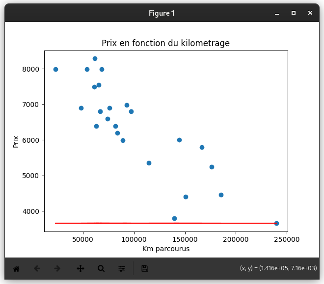
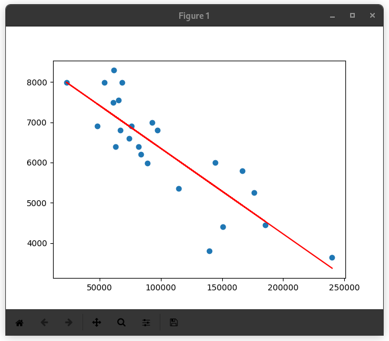

  
<h1>Linear Regression: Predicting dependent variables from independent variables 📈</h1>

## Description

Ce projet implémente une régression linéaire simple pour prédire le prix d'une voiture en fonction de son kilométrage. Le projet se compose de deux programmes distincts :

1 Programme de prédiction : Prédit le prix d'une voiture pour un kilométrage donné en utilisant un modèle entraîné.

2 Programme d'entraînement : Entraîne un modèle de régression linéaire sur un ensemble de données et enregistre les paramètres du modèle pour une utilisation future

## notion

- Compréhension du modèle de régression linéaire avec une seule variable
- Application des formules de mise à jour des paramètres via le Gradient Descent
- Importance de la normalisation des données pour améliorer la convergence de l'algorithme.
- Appréhension des bases du machine learning avec un modèle de régression linéaire, un des modèles fondamentaux en apprentissage supervisé.
- Réflexion sur l'amélioration des performances, notamment en essayant différentes valeurs de learning rate et en analysant la vitesse de convergence.
- Utilisation de la bibliothèque matplotlib pour visualiser les points de données et la ligne de régression obtenue.

